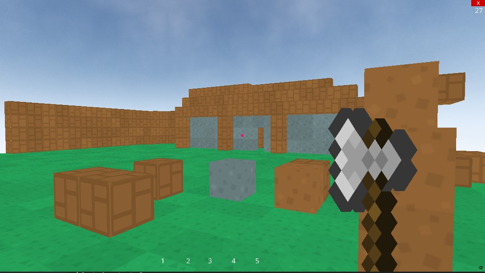

# 🟫 Minecraft Clone in Python (Ursina Engine)

This is a simple Minecraft-like voxel game built using the [Ursina Engine](https://www.ursinaengine.org/). You can walk around, place blocks, remove them, and switch between different block types — all in a smooth first-person perspective!



## 🛠 Features

- First-person movement with jumping
- Place and destroy blocks
- 4 block types: Grass, Stone, Brick, Dirt
- Basic sound effects and background music
- Simple hand/axe model for immersion
- Custom textured skybox

## 🕹 Controls

- **WASD** – Move
- **Spacebar** – Jump
- **Mouse** – Look around
- **Left Click** – Break block
- **Right Click** – Place block
- **1-4** – Switch between block types

## 📦 Requirements

- Python 3.7+
- [Ursina Engine](https://pypi.org/project/ursina/)

Install dependencies using pip:

```bash
pip install ursina
